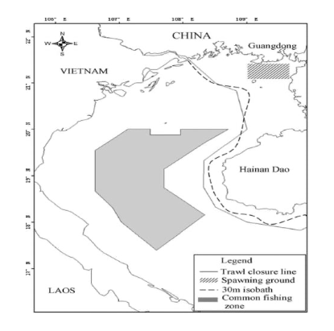
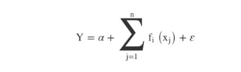
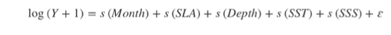
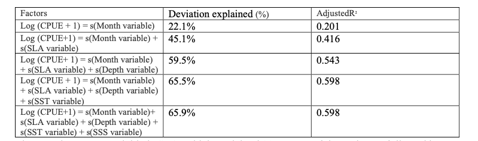
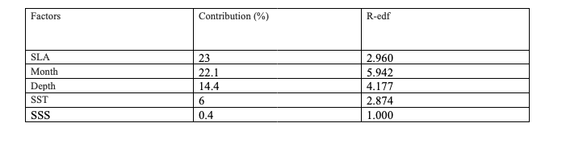

ABSTRACT

This analysis is carried out to understand the spatiotemporal variability of jack mackerel, and to analyze the interdependent factors between CPUE (dependent variable y) and the other independent variables such as SST, SSS, SSL, Depth and also their longitude and latitude locations alongside the year and month. At the Beibu Gulf, the above-mentioned fish is quite a dominant one, which is always fished by most; and as such, might be going into extinction due to it being listed as an endangered species by the ICUN.

Our analysis was in three phases, we first checked out the spread of CPUE over the months, then we showed a qqplot and histogram of residuals for the GAM statistical analysis, then we checked the level at which each of the independent variables affected the dependent variables separately, including adding some tables of statistical relevance. Then some plots show the relationship between the independent variable in relation to the geolocation and the CPUE (geospatial variance). Finally, a 3D plot showing the geospatial variability of Jack mackerel.


INTRODUCTION

Small pelagic fishes are especially important for food security and they are crucial for biological functions in marine ecosystems. They are usually used for fish oil, feed for aqua system, and meals for fish, and Agri meals (Peck et al., 2021; FAO, 2015).

There is a vital need to understand the patterns of availability for pelagic fish, so that proper management can be followed (Brehmer et al., 2007; Shi & Chen, 2019). The distribution of the fishes and their environmental variables needs to be properly understood for optimal management and availability (Hseish et al., 2010; Manderson et al., 2011).

The location of the Beibu gulf is at the north side of the south China sea at 17-22°N, 105-110°E (SCS). The area has a usual temperature of 16-27°C. The salt level gets to 5mm, these conditions are quite important for the growth of fishing and all operations pertaining to it (Sun et al., 1981).



A GAM is a non-parametric regression technique that is not constrained by linear relationships and can handle a wide range of data distribution statistics (Swartzman et al., 1995). Our aim is to investigate the spatiotemporal variability of jack mackerel, and to check the relationship between the environmental independent variables and the CPUE.


MATERIALS AND METHODS

Data collection

Dataset and instructions for spatiotemporal analysis obtained from Dr. Noel Juvigny- Khenafou. R Studio (R 4.1.3 binary for macOS 10.13) software was used to extract and analyze the dataset. GAM is used for non-linear interactions.





Y= CPUE (kg/km2), α= intercept of the function, fi(xj) = spline smoothing function (Feng et al., 2021). CPUE is density of jack mackerel by a trawl (unit: kilograms per square kilometer), s = the natural spline smoothing function; s(Month variable) = the effect of month; s(SLA variable) = the effect of sea level anomaly; s(Depth variable) = the effect of depth; s(SST variable) = sea surface temperature; s(SSS variable) = the effect of sea surface salinity.


RESULTS

1.  RESOURCE DENSITY

The different months and the CPUE are plotted, which shows us how the CPUE variate. We can observe the spread in Fig 2, and see that the fluctuations are periodical from February to November. The highest resource density was in November, and the lowest in February.

```{r, echo=FALSE, error=FALSE, warning=FALSE, results='hide'}
gamdata = read.csv("fish_cpue.csv")
head(gamdata)
#Uni variate GAM analysis
library(mgcv)
# Fit a linear model
gam1 <- lm(CPUE ~ Month, data = gamdata)
# Visualize the model
#Seasonal variation in T. japonicus CPUE
bp<-boxplot(CPUE ~ Month, data=gamdata,
        col=(c("gold","red")),
        main="Boxplot of resource density in the four different months", xlab="Months",
        ylab="CPUE(kg/km2)")
bp
```

Figure 2: A boxplot diagram depicting the density of resources in the four major months and the amount of CPUE.


2.  GAM ANALYSIS

The GAM formula used for statistical calculation is:




We can also see the QQplot (theoretical quantiles) in figure 3, we observe a normal distribution in Figure 4, and the normality was passed by the residuals and distributed appropriately. 

```{r, echo=FALSE, error=FALSE, warning=FALSE, results='hide'}
#check model statistics
gamall <- gam(log(CPUE + 1) ~  s(Month, k = 4) + s(SLA) + s(Depth) + s(SST, k = 4) + s(SSS, k = 4), 
                data = gamdata, method = "REML") 
summary(gamall)
gam.check(gamall)

#model statistics for each environmental factor
summary (gam(log(CPUE + 1) ~  s(Month, k = 4), data = gamdata, method = "REML"))
summary (gam(log(CPUE + 1) ~  s(SLA), data = gamdata, method = "REML"))
summary (gam(log(CPUE + 1) ~  s(SST), data = gamdata, method = "REML"))
summary ( gam(log(CPUE + 1) ~  s(SSS), data = gamdata, method = "REML"))
summary (gam(log(CPUE + 1) ~  s(Depth), data = gamdata, method = "REML"))

#Checking with model factors
summary (gam(log(CPUE + 1) ~  s(Month, k = 4) + s(SLA), data = gamdata, method = "REML"))
summary (gam(log(CPUE + 1) ~  s(Month, k = 4) + s(SLA) + s(Depth), data = gamdata, method = "REML"))
summary (gam(log(CPUE + 1) ~  s(Month, k = 4) + s(SLA) + s(Depth) + s(SST), data = gamdata, method = "REML"))
summary (gam(log(CPUE + 1) ~  s(Month, k = 4) + s(SLA) +s(Depth) +s(SST) +s(SSS),data = gamdata, method = "REML")) 

```

Figure 3: A QQplot depicting the theoretical quantiles.  
Figure 4: A normally distributed diagram showing the histogram of residuals.


3.  ALL THE SELECTED VARIABLES AND THEIR CONTRIBUTIONS IN GAM

The graph below depicts the environmental variables that have a nonlinear connection factor and CPUE Figure 5, the most CPUE of jack mackerel happened from June-August, with a considerable rise in August, according to correlations between CPUE and GAM explanatory factors. Between April and August, there was a beneficial influence of season on CPUE, but negative effects from October to February (Fig. 5a). SLA had a beneficial effect on CPUE at -0.2 m and 0.1-0.3 m, but had a detrimental effect between -0.1-0.09 m. (Fig. 5b). Between -80 and -70 m depth, there was a positive influence on CPUE, but between -60 m and -20 m depth, there was a negative effect (Fig. 5c). At less than 23 °C, we can see a positive relationship, and above 23 °C we can see a negative effect (Fig 5d). CPUE was positively affected by salinity from 30.0 to 32 PSU (Fig 5e).

```{r,echo=FALSE, error=FALSE, warning=FALSE, results='hide'}
plot(gamall, pages = 1, shade = TRUE, shade.col = "DarkGreen" )
```

Figure 5: The effect of SST, SLA, Month, Depth, and SSS on the CPUE of Jack mackerel. The points of the rug depict the data point of the fishing. A positive effect on the CPUE can be seen from all the variables involved.


Table 1: GAM test modeling of the CPUE of jack mackerel, and its matching factors.



The most important variable is SLA, which explained 23 percent of the variance, followed by Month, Depth, SST, and SSS, which explained 22.1 percent, 14.4%, 6%, and 0.4 percent of the variance, respectively. All the variables were significant except SSS. 


Table 2: The environmental factors and their contributions to GAM. 



4.  THE SPATIOTEMPORAL DISTRIBUTION OF JACK MACKEREL AND ITS RELATIONSHIP WITH CPUE AND OTHER OCEANOGRAPHIC VARIABLES.

T. Japonicus CPUE and SST and CPUE and SSS relationships demonstrate an elevated level of CPUE in August, when the temperature is between 30-33°C (Fig 6), and the PSU is (32-33) (Fig 7). For both SST and SSS, February has the lowest occurrence of CPUE. Relationships between the jack mackerel spatial and temporal distribution CPUE and water depth showed that the majority of CPUE occurs at depths of -80 m, and that CPUE increases and subsequently decreases with depth --40 m, with a high at -70 m. We have depths ranging from --20 to --80m from February to May (Fig, 8).


```{r, echo=FALSE, error=FALSE, warning=FALSE, results='hide'}
library(ggplot2)
library(metR)
library(data.table)

#SST and CPUE
sst<-ggplot(gamdata, aes(Lon, Lat, z = SST)) + labs(y="Latitude", x="Longitude",
        title="Relationship between SST and CPUE") +
  geom_contour_fill(na.fill = TRUE) + geom_jitter(aes(size= CPUE)) + 
  theme(legend.position="left") + labs(fill = "SST (°C)")
  sst + facet_wrap( ~ Month, scales = "free")
```

Figure 6: A plot showing a spatiotemporal relationship between the CPUE of jack mackerel and SST with 2, 5, 8, and 11 representing February, May, August, and November, respectively.


```{r, echo=FALSE, error=FALSE, warning=FALSE, results='hide'}
#SSS AND CPUE
sss<-ggplot(gamdata, aes(Lon, Lat, z = SSS)) + labs(y="Latitude", x="Longitude",
      title="Relationship between SSS and CPUE") +
  geom_contour_fill(na.fill = TRUE) + geom_jitter(aes(size= CPUE)) + 
  theme(legend.position="left") + labs(fill = "SSS (PSU)")
sss + facet_wrap( ~ Month, scales = "free")
```

Figure 7: A plot showing a spatiotemporal relationship between the CPUE of jack mackerel and SSS with 2, 5, 8, and 11 representing February, May, August, and November, respectively.


```{r, echo=FALSE, error=FALSE, warning=FALSE, results='hide'}
#Depth AND CPUE
depth<-ggplot(gamdata, aes(Lon, Lat, z = Depth)) + labs(y="Latitude", x="Longitude",
        title="Relationship between Water Depth and CPUE") +
  geom_contour_fill(na.fill = TRUE) + geom_jitter(aes(size= CPUE)) + 
  theme(legend.position="left") + labs(fill = "Depth")
depth + facet_wrap( ~ Month, scales = "free")

```

Figure 8: A plot showing a spatiotemporal relationship between the CPUE of jack mackerel and Water Depth with 2, 5, 8, and 11 representing February, May, August, and November, respectively.


5.  THE SPATIOTEMPORAL VARIABILITY OF THE JACK MACKEREL CPUE IN 3D PLOT. The graph below (Fig, 9) shows the spread of CPUE across various locations and the months. We can see in Fig 10, a large level of CPUE in a range of 107-108 °E and 18-20 °N. We observe a lower occurrence of CPUE around 109-109.5 °E. In figure 11, we can observe CPUE between February to August 2014, with high occurrences, especially in August. Then from October to December 2013, we can see a slight occurrence of CPUE.

```{r, echo=FALSE, error=FALSE, warning=FALSE, results='hide'}
library(scatterplot3d)
aa<-scatterplot3d(
  gamdata[,c(2,4,3,5 )], pch = 19,
  main = "Spatial and temporal variability of T. japonicus CPUE", highlight.3d=TRUE,
  col.grid="lightblue",
  grid = TRUE, box = FALSE, type= "h",
  mar = c(3, 3, 0.5, 3),       
)

```

Figure 9: A 3D scatter plot showing the spatiotemporal variations of the jack mackerel CPUE.


```{r, echo=FALSE, error=FALSE, warning=FALSE, results='hide'}
ggplot(gamdata, aes(Month, Year)) + geom_jitter(aes(size= CPUE))


```

Figure 10: Spatial variability of the jack mackerel.


```{r, echo=FALSE, error=FALSE, warning=FALSE, results='hide'}
ggplot(gamdata, aes(Lon, Lat)) + geom_jitter(aes(size= CPUE))
```

Figure 11: Temporal variability of the jack mackerel.


DISCUSSION

A mixed Generalized Additive Model (GAM) was utilized to predict spatial variability for Jack mackerel fish depending on location across time. To begin building the model, a GAM was utilized as an exploratory tool to discover the functional correlations between environmental factors and CPUE. All environmental variables were considered such as SSS, SST, SLA, WATER DEPTH of which most were highly significant in predicting the CPUE variation over the different months.


1.  THE SPATIOTEMPORAL VARIATION OF JACK MACKEREL.

The CPUE of Jack mackerel varies spatially and temporally in the Beibu Gulf, with high numbers in August and exceptionally sparse numbers in February. Figures 9,10,11 show how the different months have varying impacts on the CPUE of jack mackerel. Distinct levels of heat, and variations in temperature, including the jack mackerel biomass can account for being the major causes of variations in the CPUE of jack mackerel (Fan et al., 2018). The location of the jack mackerel CPUE can be seen mostly at 107-109.5°E and 18-21°N (Fig, 6,7,8). The primary dispersion of the jack mackerel CPUE can be observed in between 107-108.8 °E and 20.5-21° N in May, due to the flatness of the seabed at that period. The summer variation of the CPUE may be explained by currents and winds (Wang et al; 2011a). It is also pertinent to note that by this time of the year, the temperature and SSS levels also increase, which makes it perfect for baby fishes to thrive successfully (Chen et al., 2005, Yan et al., 2018). During the fall season when the heat drops, the fishes migrate to the not so deep parts to spawn, hence they can also be found around those areas (Chen et al., 2005).


2.  THE CPUE RELATIONSHIP WITH OTHER ENVIRONMENTAL VARIABLES.

Most of the distribution and the spatiotemporal variability of the CPUE of jack mackerel can be accounted for by Temperature (Cui et al., 2010; Niu et al., 2010; Niu et al., 2010; Niu, Li & Xu, 2010), and salinity, water depth, SSS, which impacts the level of survivability and reproducibility of the fish (Sassa et al.,2014; Sassa et al.,2008). The varying temperatures can be observed throughout the year, with the highest CPUE in August with SST of 25-30°C and the lowest in February with temperature as low as 15°C (Fig, 6). It can be pertinent to note that the heat level of water in the beibu gulf is higher than that of the East China Sea (Li et al, 2016). SSS only explained 0.4 percent of the T. japonicus CPUE (Table 2), which could be due to the small quantity of data available for this study. Temperature, salinity, and other oceanographic characteristics are all subject to fast change (Chen, Wang & Guo, 2006). Climate factors can also cause changes in SST and SSS (Bell et al., 2013), which will in turn have a profound effect on the spatial and temporal variations on the CPUE of jack mackerel.

The CPUE is affected by depth (explaining 14.4 percent, Table 2). Temperature, salinity, and current velocity are all affected by depth, which has a direct impact on temporal changes in hydrological factors over time and space. Furthermore, increasing depth is associated with less fluctuation in each of these characteristics as a generality (Chen, 2004). The maximum CPUE of T. japonicus was found near the mouth of Beibu Gulf, primarily between -80 and -60 m, this species thrives in deeper waters, which give a more suitable environment. (Yan et al., 2019).


CONCLUSION

The data from four different months in relation to SST, SSL, SSS, and seasonal variations are used to analyze the spatiotemporal variation of the Jack Mackerel CPUE.

1.  Positive effects: SST of less than 23C, SSS between 30-32 PSU, SLA of --0.2 m and between 0.1-0.3 m, water depth -80 and -70 m.
2.  Negative effects: SLA between -0.1-0.09 m, SST above 23C, water depth --60 to --20m.
3.  The most crucial factors for the prediction of the CPUE are the SLA, Month, and water depth at 23, 22.1 and 14.4%.
4.  The GAM model did well in the expected predictions of the CPUE by the various independent variables.

REFERENCES

Bell, J. D., Ganachaud, A., Gehrke, P. C., Griffiths, S. P., Hobday, A. J., Hoegh-Guldberg, O., ... & Waycott, M. (2013). Mixed responses of tropical Pacific fisheries and aquaculture to climate change. Nature Climate Change, 3(6), 591-599.

Brehmer, P., Gerlotto, F., Laurent, C., Cotel, P., Achury, A., & Samb, B. (2007). Schooling behaviour of small pelagic fish: phenotypic expression of independent stimuli. Marine Ecology Progress Series, 334, 263-272.
Chen XJ. 2004. Fishery resources and fishery oceanography. Beijing: China Ocean Press.

Chen, X., Wang, X., & Guo, J. (2006). Seasonal variability of the sea surface salinity in the East China Sea during 1990–2002. Journal of Geophysical Research: Oceans, 111(C5).

Chen Z, Qiu YS. 2005. Ecological distribution of Paragyrops edita Tanaka in the Beibu Gulf. Marine Fisheries Research.

Fan JT, Feng X, Chen ZZ. 2018.  "Fishing ground analysis of Japanese horse mackerel in northern South China Sea based on vertical structure of water temperature.". South China Fisheries Science 14(002):124-128.

Feng, Y., Shi, H., Hou, G., Zhao, H., & Dong, C. (2021). Relationships between environmental variables and spatial and temporal distribution of jack mackerel (Trachurus japonicus) in the Beibu Gulf, South China Sea. PeerJ, 9, e12337.

Hsieh, C. H., Yamauchi, A., Nakazawa, T., & Wang, W. F. (2010). Fishing effects on age and spatial structures undermine population stability of fishes. Aquatic Sciences, 72(2), 165-178.

Li, G., Cao, J., Zou, X., Chen, X., & Runnebaum, J. (2016). Modeling habitat suitability index for Chilean jack mackerel (Trachurus murphyi) in the South East Pacific. Fisheries Research, 178, 47-60.

Peck, M. A., Alheit, J., Bertrand, A., Catalán, I. A., Garrido, S., Moyano, M., ... & van Der Lingen, C. D. (2021). Small pelagic fish in the new millennium: a bottom-up view of global research effort. Progress in Oceanography, 191, 102494.

Sassa, C., Takahashi, M., Nishiuchi, K., & Tsukamoto, Y. (2014). Distribution, growth and mortality of larval jack mackerel Trachurus japonicus in the southern East China Sea in relation to oceanographic conditions. Journal of Plankton Research, 36(2), 542-556.

Swartzman, G., Silverman, E., & Williamson, N. (1995). Relating trends in walleye pollock (Theragra chalcogramma) abundance in the Bering Sea to environmental factors. Canadian Journal of Fisheries and Aquatic Sciences, 52(2), 369- 380.

Yan R, Fan JT, Xu SN, Xu YW, Sun MS, Chen ZZ. 2018. Spatial distribution of jack mackerel(Trachurus japonicus) in the northern South China Sea based on geostatistics. Journal of Tropical Oceanography 37(8):2430-2435.


